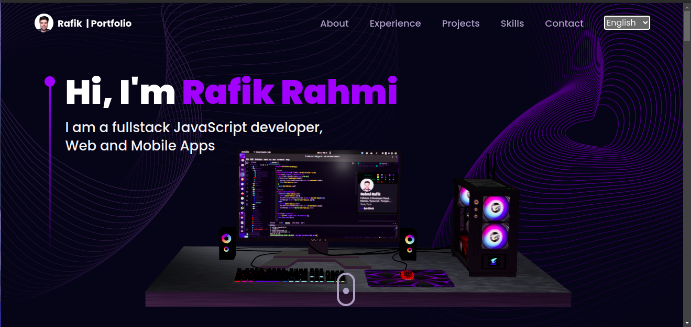

# 3D Portfolio

This is a 3D portfolio website built using **Three.js**, **React.js**, and **TailwindCSS**. The website showcases various projects and includes immersive 3D elements for a modern, interactive user experience.

## Features

-   3D scenes created using **React Three Fiber** (Three.js for React)
-   Responsive design with **TailwindCSS**
-   Optimized performance and smooth animations
-   Modular and reusable components
-   Dark mode support

## Technologies

-   **Languages**: JavaScript, TypeScript
-   **Frontend**: React.js, React Three Fiber (Three.js), TailwindCSS
-   **Build Tools**: Vite, npm
-   **Version Control**: Git
-   **Deployment**: Vercel

## Preview



## Setup and Installation

To run this project locally, you will need **Node.js** version 20 or above.

### Clone the repository

```bash
git clone https://github.com/RafikElRahmi/Portfolio-3D
```

```bash
cd Portfolio-3D
```

### Install the dependencies

Using npm:

```bash
npm install
```
Using yarn:

```bash
yarn install
```

### Run the project

Using npm:

```bash
npm run dev
```
Using yarn:

```bash
yarn dev
```
